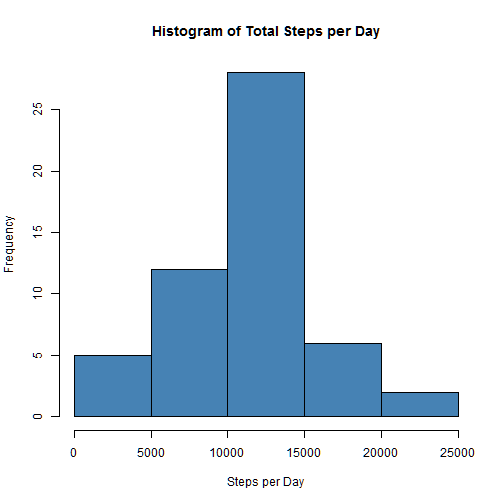
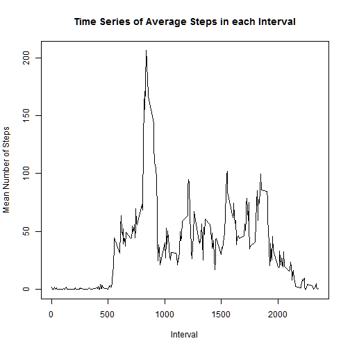
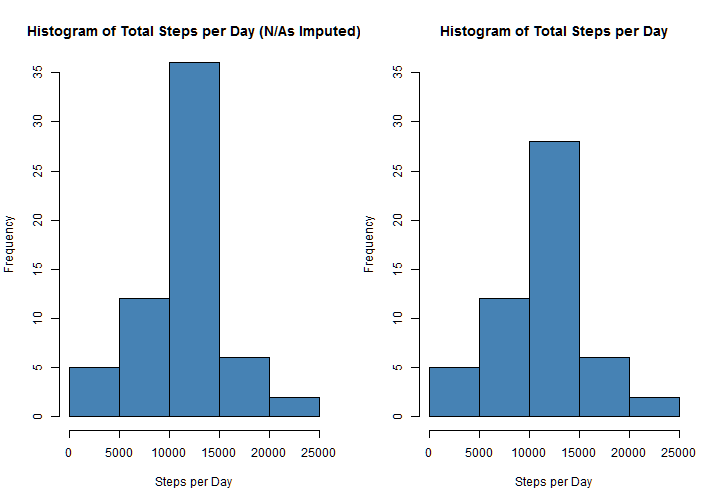
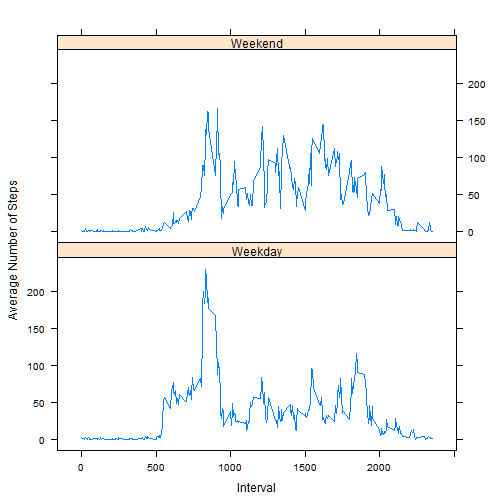

This document assumes that you have the data downloaded and unzipped into your working directory.

## Loading and preprocessing the data

#### 1. Load the data (i.e. read.csv())
Begin by reading in the data. 

```r
    activity<-read.csv("activity.csv")
```
#### 2. Process/transform the data (if necessary) into a format suitable for your analysis
Leave the date variable in factor format in order to more easily separate the steps by date in the next step.  Create a new variable to contain the date in date format.  Copy the date variable into this variable and converte it to date format.  This will be useful later on when distinguishing between weekends and weekdays.

```r
    activity<-data.frame(activity, date2=activity$date)
    activity$date2<-as.Date(activity$date2, format="%Y-%m-%d")
```

## What is mean total number of steps taken per day?

#### 1. Make a histogram of the total number of steps taken each day
First divide the steps by day.  Then sum each day.  Finally, make a histogram of the total number of steps each day.

```r
    split.steps<-split(activity$steps, activity$date)
    steps.per.day<-sapply(split.steps, sum)
    hist(steps.per.day, col="steelblue", main="Histogram of Total Steps per Day", xlab="Steps per Day")
```

 

#### 2. Calculate and report the mean and median total number of steps taken per day

Calculate the mean and median, label them and report them.

```r
    paste0("Mean = ", round(mean(steps.per.day, na.rm=TRUE), 2)); paste0("Median = ", median(steps.per.day, na.rm=TRUE))
```

```
## [1] "Mean = 10766.19"
```

```
## [1] "Median = 10765"
```
## What is the average daily activity pattern?

#### 1. Make a time series plot (i.e. type = "l") of the 5-minute interval (x-axis) and the average number of steps taken, averaged across all days (y-axis)

First split the steps data into sections by interval, so that the first interval of each day is in one group, the second interval of each day is in the second group, etc.  Then take the mean of each interval across all days.  Finally, plot the time series of the results.

```r
    split.by.interval<-split(activity$steps, as.factor(activity$interval))
    mean.per.interval<-sapply(split.by.interval, mean, na.rm=TRUE)
    plot(mean.per.interval~names(mean.per.interval), type="l", 
        main="Time Series of Average Steps in each Interval", xlab="Interval", ylab="Mean Number of Steps")
```

 

#### 2. Which 5-minute interval, on average across all the days in the dataset, contains the maximum number of steps?

Find the interval that has the highest average number of steps using the max function, label it, and report it.

```r
    paste0("The interval with the maximum average number of steps is interval ", 
           names(mean.per.interval[mean.per.interval == max(mean.per.interval)]))
```

```
## [1] "The interval with the maximum average number of steps is interval 835"
```

## Imputing missing values

#### 1. Calculate and report the total number of missing values in the dataset (i.e. the total number of rows with NAs)

First count the number of missing values and report the value.

```r
    paste0("The number of missing values is ", sum(!complete.cases(activity)))
```

```
## [1] "The number of missing values is 2304"
```

#### 2. Devise a strategy for filling in all of the missing values in the dataset. The strategy does not need to be sophisticated. For example, you could use the mean/median for that day, or the mean for that 5-minute interval, etc.

Since most of the missing values are entire missing days of data, it makes more sense to replace them with the mean across all days of the interval in which they appear than with the mean of that day.  That is the method that is used below.

#### 3. Create a new dataset that is equal to the original dataset but with the missing data filled in.

First, make a copy of the data frame.  Then replace each NA with the average for the interval in which it appears, which was calculated above.


```r
   activity.complete<-activity
    
    for (i in 1:length(activity$steps)){
        
        if (is.na(activity.complete$steps[i])) {
            interval<-as.character(activity.complete$interval[i])
            activity.complete$steps[i]<-mean.per.interval[interval]
        }
    }
```

#### 4. Make a histogram of the total number of steps taken each day and Calculate and report the mean and median total number of steps taken per day. Do these values differ from the estimates from the first part of the assignment? What is the impact of imputing missing data on the estimates of the total daily number of steps?

Recreate the analysis from part 1 on this new data frame and compare it to the old results:

First, compare histograms of the total number of steps each day.

```r
    split.complete.steps<-split(activity.complete$steps, activity$date)
    complete.steps.per.day<-sapply(split.complete.steps, sum)
    par(mfrow=c(1,2))
    hist(complete.steps.per.day, col="steelblue", main="Histogram of Total Steps per Day (N/As Imputed)", 
         xlab="Steps per Day", ylim=c(0,35))
    hist(steps.per.day, col="steelblue", main="Histogram of Total Steps per Day", 
         xlab="Steps per Day", ylim=c(0, 35))
```

 

The histograms are generally a similar shape but the middle bin (or bar) is higher/ more frequent after imputing the NAs.

Now compare the means and medians of the two distributions.

```r
    paste0("Mean (ignore NA's) = ", round(mean(steps.per.day, na.rm=TRUE), 2)); paste0("Mean (impute NA's) = ", round(mean(complete.steps.per.day, na.rm=TRUE), 2))
```

```
## [1] "Mean (ignore NA's) = 10766.19"
```

```
## [1] "Mean (impute NA's) = 10766.19"
```

```r
    paste0("Median (ignore NAs) = ", median(steps.per.day, na.rm=TRUE)); paste0("Median (impute NA's) = ", round(median(complete.steps.per.day, na.rm=TRUE), 2))
```

```
## [1] "Median (ignore NAs) = 10765"
```

```
## [1] "Median (impute NA's) = 10766.19"
```

The mean has not changed at all, while the median has been shifted to match the mean.  This is because of the pattern of the NAs combined with the method used to replace them.  The NAs only existed as entire days that were missing data.  Therefore, when they were each replaced with the average value of their interval, the total number of steps in those previously NA days was exactly equal to the average number of total steps per day.  Adding more days that have exactly the mean number of steps per does not change that mean but it can change the median.  In this case, it moved the median to one of the days with exactly the mean number of steps.

## Are there differences in activity patterns between weekdays and weekends?

#### 1. Create a new factor variable in the dataset with two levels – "weekday"" and "weekend"" indicating whether a given date is a weekday or weekend day.

Use the weekdays function to create a list of all the names of the weekdays, then use that list to create a vector that has "weekday" on weekdays and "weekend" on weekends.  Add this vector to the data frame as a factor.

```r
    weekdays<-weekdays(activity.complete$date2)
    day.factor<-rep("weekday", length(activity.complete$date2))
    day.factor[weekdays=="Saturday" | weekdays == "Sunday"]<-"weekend"

    activity.complete<-data.frame(activity.complete, day=as.factor(day.factor))
```

#### 2. Make a panel plot containing a time series plot (i.e. type = "l") of the 5-minute interval (x-axis) and the average number of steps taken, averaged across all weekday days or weekend days (y-axis).

First split the data into by weekend/weekday then find the average of each interval across all weekdays and across all weekends.  Use a similar process as was used above to find the averages across all days.

```r
    split.weekdays<-split(activity.complete[c(1,3)], activity.complete$day)

    f<-function(x) split(x[,1], x[,2])
    split.days.intervals<-lapply(split.weekdays,FUN= f)

    mean.per.interval.weekday<-sapply(split.days.intervals$weekday, mean)
    mean.per.interval.weekend<-sapply(split.days.intervals$weekend, mean)
```

Now, recombine all of the results into one data frame so that it can be more easily graphed.

```r
    day.means.interval.data<-data.frame(
        int=c(names(mean.per.interval.weekday), names(mean.per.interval.weekend)), 
        means=c(mean.per.interval.weekday, mean.per.interval.weekend), 
        day=c(rep("Weekday", length(mean.per.interval.weekday)), rep("Weekend", length(mean.per.interval.weekend))))
```

Load the lattice library to make the plot, convert the intervals from a factor variable to a numeric variable, and graph the results.


```r
    library(lattice)
    day.means.interval.data$int<-as.numeric(as.character(day.means.interval.data$int))
    xyplot(means~int|day, data=day.means.interval.data, type="l", layout=c(1,2), 
           xlab="Interval", ylab="Average Number of Steps")
```

 

There is a noticable difference between these two plots.  On the weekends, activity appears to be fairly contsant during waking hours.  On Weedays, however, there is a big spike in the morning followed by low levels for the remainder of the waking hours.
