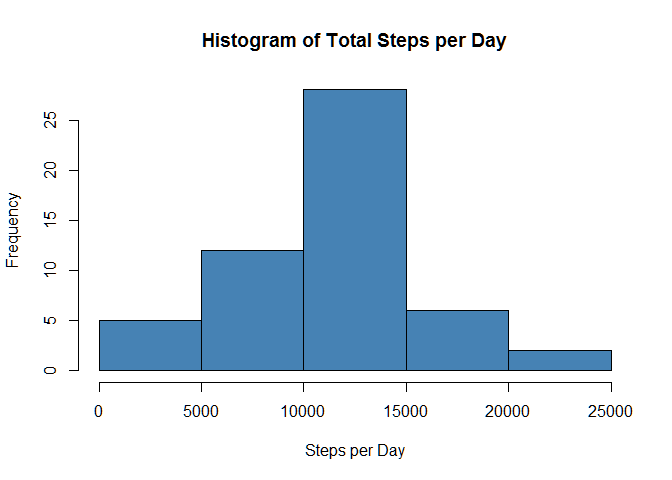
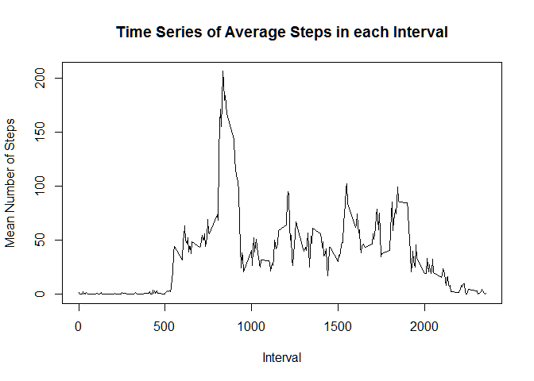

# Reproducible Research: Peer Assessment 1
This document assumes that you have the data downloaded and unzipped into your working directory.

## Loading and preprocessing the data
Begin by reading in the data. I have left the date variable in factor format in order to more easily separate the steps by date in the next step.

```r
activity<-read.csv("activity.csv")
```

## What is mean total number of steps taken per day?

First divide the steps by day.  Then sum each day.  Finally, make a histogram of the total number of steps each day.

```r
split.steps<-split(activity$steps, activity$date)
steps.per.day<-sapply(split.steps, sum)
hist(steps.per.day, col="steelblue", main="Histogram of Total Steps per Day", xlab="Steps per Day")
```

 

Calculate the mean and median of the total number of steps per day.

```r
    paste0("Mean = ", round(mean(steps.per.day, na.rm=TRUE), 2)); paste0("Median = ", median(steps.per.day, na.rm=TRUE))
```

```
## [1] "Mean = 10766.19"
```

```
## [1] "Median = 10765"
```
## What is the average daily activity pattern?

First split the steps data into sections by interval, so that the first interval of each day is in one group, the second interval of each day is in the second group, etc.  Then take the mean of each interval across all days.  Finally, plot the time series of the results.

```r
    split.by.interval<-split(activity$steps, as.factor(activity$interval))
    mean.per.interval<-sapply(split.by.interval, mean, na.rm=TRUE)
    plot(mean.per.interval~names(mean.per.interval), type="l", main="Time Series of Average Steps in each Interval", xlab="Interval", ylab="Mean Number of Steps")
```

 

Now find the interval that has the highest average number of steps.

```r
    paste0("The interval with the maximum average number of steps is interval ", names(mean.per.interval[mean.per.interval == max(mean.per.interval)]))
```

```
## [1] "The interval with the maximum average number of steps is interval 835"
```

## Imputing missing values

First count the number of missing values.

```r
sum(!complete.cases(activity))
```

```
## [1] 2304
```

Since most of the missing values are entire missing days of data, I have chosen to replace them with the mean across all days of the interval in which they appear.

## Are there differences in activity patterns between weekdays and weekends?
